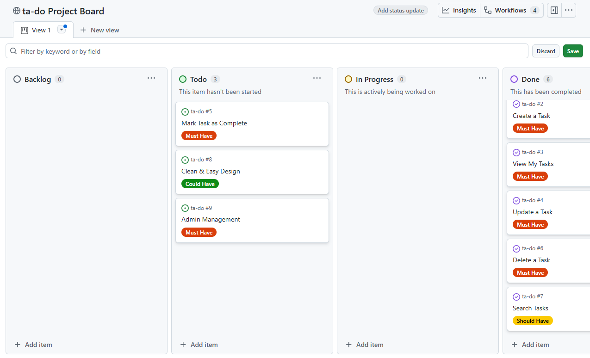

## Table Of Contents:
1. [Design & Planning](#design-&-planning)
    * [User Stories](#user-stories)
    * [Wireframes](#wireframes)
    * [Agile Methodology](#agile-methodology)
    * [Typography](#typography)
    * [Colour Scheme](#colour-scheme)
    * [Database Diagram](#database-diagram)
    
2. [Features](#features)
    * [Navigation](#Navigation)
    * [Footer](#Footer)
    * [Home page](#Home-page)
    * [add your pages](#)
    * [CRUD](#CRUD)
    * [Authentication & Authorisation](#Authentication-Authorisation )

3. [Technologies Used](#technologies-used)
4. [Libraries](#libraries-used)
5. [Testing](#testing)
6. [Bugs](#bugs)
7. [Deployment](#deployment)
8. [Credits](#credits)

## Design & Planning:

### User Stories

- As a new user, I need to register and log in, so that I can securely access my personal to‑do list.
- As a user, I want the app to have a clean and intuitive interface, so that using it feels effortless and enjoyable.
- As a user, I need to create a task, so that I can keep track of things I need to do.
- As a user, I need to view my list of tasks, so that I can see what I need to do.
- As a user, I need to update a task, so that I can correct or change its details.
- As a user, I need to delete a task, so that I can remove items I no longer need.
- As a user, I need to mark a task as complete, so that I can track my progress.
- As a user, I need to search my tasks, so that I can quickly find a specific one.
- As an admin, I need to manage all users and tasks, so that I can maintain the system.

All user stories are included in my project board which which can be accessed by clicking [here](https://github.com/users/kens-i/projects/11).

---

### Wireframes
Attach wireframes in this section

---

### Agile Methodology
For this Django-based full-stack web application, I adopted an Agile approach to ensure structured planning, iterative progress, and alignment with user needs. I utilised Github Projects toto create a Kanban board to manage tasks and track development milestones. The web application was broken down into clearly defined user stories, each mapped to specific project goals and functional requirements. To guide prioritisation, I applied the MoSCoW method, which enabled me to distinguish between essential features and enhancements, ensuring that critical functionality was delivered first. From the outset, the focus was on building a Minimum Viable Product (MVP) — a streamlined version of the application that included core features such as user authentication, task creation, and responsive design. This methodology supported a disciplined yet flexible development process, resulting in a user-friendly and purpose-driven application.

To access the Kanban board you can click on the link provided in the User Stories section above. I have also provided a screenshot below: (please note this screenshot was taken prior to completing all tasks. All tasks have now been moved to 'Done'.)

---

### Typography
For this project, I chose Space Grotesk and Dosis as the primary typefaces to reflect the visual identity established in the logo, which I designed in Canva using Neue Machina and 29LT Zawi. Since those original fonts aren’t available on Google Fonts, I selected Space Grotesk for its clean, geometric structure that closely mirrors the modern, technical feel of Neue Machina. Dosis adds a softer, rounded contrast that complements the contemporary tone of 29LT Zawi. Together, these fonts help maintain a cohesive and polished aesthetic across the app, supporting both readability and brand consistency.

---

### Colour Scheme
Screenshoot of the colour scheme for your project

---

### DataBase Diagram
Image of the database diagram for your project, you can name your database models as well and how they are connected

## Features:
Explain your features on the website,(navigation, pages, links, forms, input fields, CRUD....)
### Navigation
### Footer
### Home-page
### CRUD
### Authentication-Authorisation 
## Technologies Used
List of technologies used for your project
## Testing
Important part of your README!!!
### Google's Lighthouse Performance
Screenshots of certain pages and scores (mobile and desktop)
### Browser Compatibility
Check compatability with different browsers
### Responsiveness
Screenshots of the responsivness, pick few devices
### Code Validation
Validate your code HTML, CSS, JS & Python (all pages/files need to be validated!!!), display screenshots
### Manual Testing user stories
Test all your user stories, you an create table 
User Story |  Test | Pass
--- | --- | :---:
paste here you user story | what is visible to the user and what action they should perform | &check;
attach screenshot
### Manual Testing features
Test all your features, you can use the same approach 
| Feature | Action | Status | 
|:-------:|:--------| :--------|
| description | user steps | &check; |
attach screenshot

## Bugs
List of bugs and how did you fix them

## Deployment
This website is deployed to Heroku from a GitHub repository, the following steps were taken:

#### Creating Repository on GitHub
- First make sure you are signed into [Github](https://github.com/) and go to the code institutes template, which can be found [here](https://github.com/Code-Institute-Org/gitpod-full-template).
- Then click on **use this template** and select **Create a new repository** from the drop-down. Enter the name for the repository and click **Create repository from template**.
- Once the repository was created, I clicked the green **gitpod** button to create a workspace in gitpod so that I could write the code for the site.

#### Creating an app on Heroku
- After creating the repository on GitHub, head over to [heroku](https://www.heroku.com/) and sign in.
- On the home page, click **New** and **Create new app** from the drop down.
- Give the app a name(this must be unique) and select a **region** I chose **Europe** as I am in Europe, Then click **Create app**.

#### Create a database 
- Log into [CIdatabase maker](https://www.heroku.com/](https://dbs.ci-dbs.net/))
- add your email address in input field and submit the form
- open database link in your email
- paste dabase URL in your DATABASE_URL variable in env.py file and in Heroku config vars

#### Deploying to Heroku.
- Head back over to [heroku](https://www.heroku.com/) and click on your **app** and then go to the **Settings tab**
- On the **settings page** scroll down to the **config vars** section and enter the **DATABASE_URL** which you will set equal to the elephantSQL URL, create **Secret key** this can be anything,
**CLOUDINARY_URL** this will be set to your cloudinary url and finally **Port** which will be set to 8000.
- Then scroll to the top and go to the **deploy tab** and go down to the **Deployment method** section and select **Github** and then sign into your account.
- Below that in the **search for a repository to connect to** search box enter the name of your repository that you created on **GitHub** and click **connect**
- Once it has been connected scroll down to the **Manual Deploy** and click **Deploy branch** when it has deployed you will see a **view app** button below and this will bring you to your newly deployed app.
- Please note that when deploying manually you will have to deploy after each change you make to your repository.

## Credits
List of used resources for your website (text, images, snippets of code, projects....)
