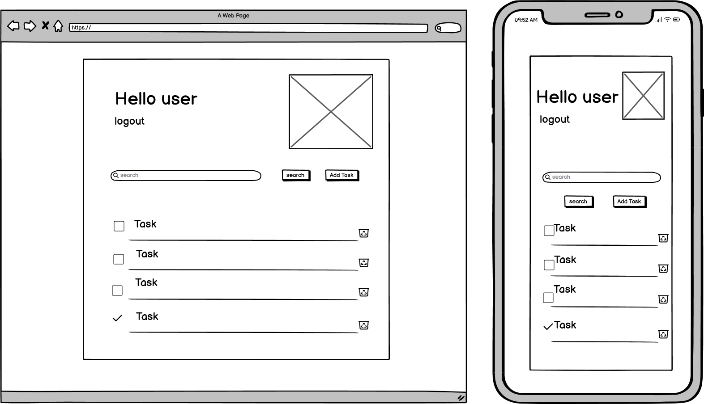
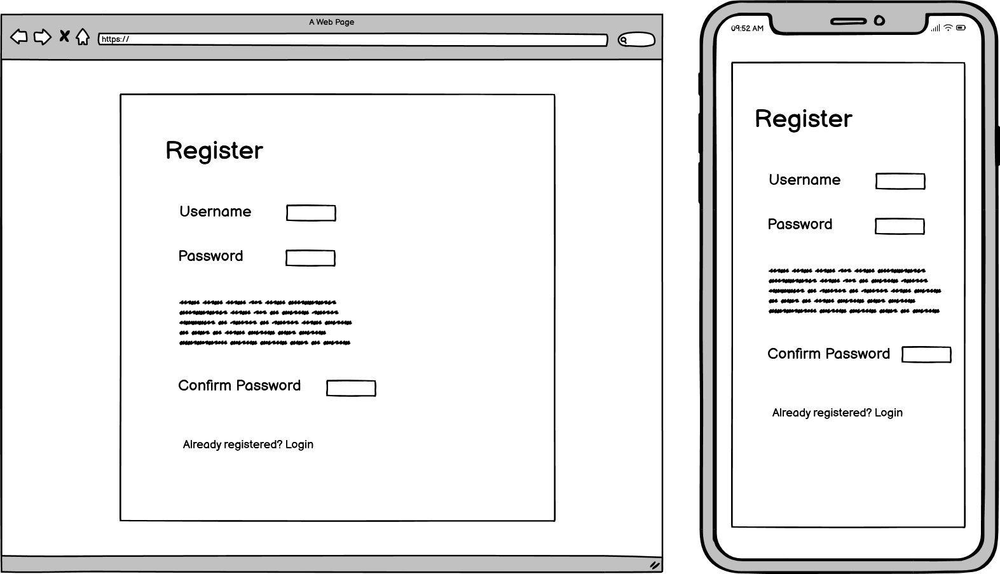
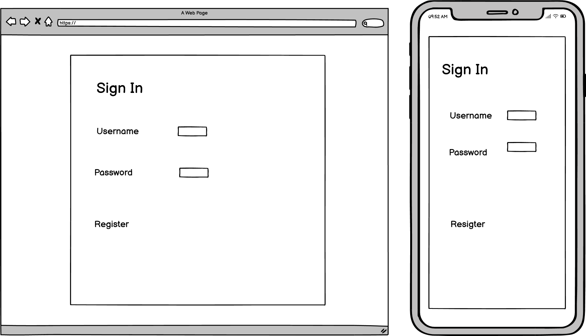
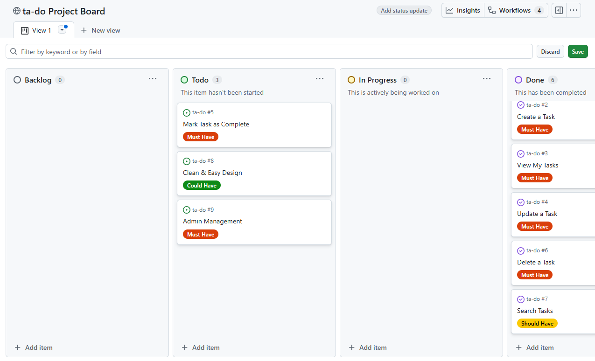
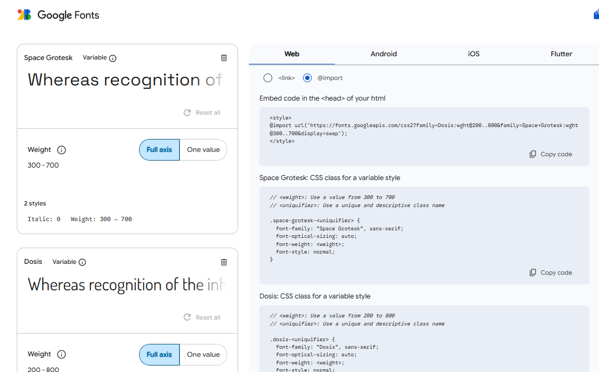
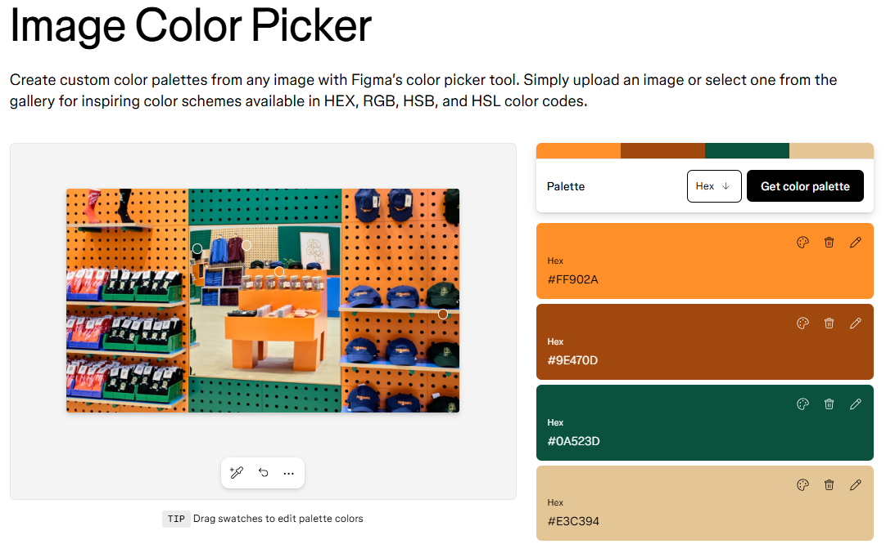

## Table Of Contents:
1. [Design & Planning](#design-&-planning)
    * [User Stories](#user-stories)
    * [Wireframes](#wireframes)
    * [Agile Methodology](#agile-methodology)
    * [Typography](#typography)
    * [Colour Scheme](#colour-scheme)
    * [Database Diagram](#database-diagram)
    
2. [Features](#features)
    * [Navigation](#Navigation)
    * [Footer](#Footer)
    * [Home page](#Home-page)
    * [add your pages](#)
    * [CRUD](#CRUD)
    * [Authentication & Authorisation](#Authentication-Authorisation )

3. [Technologies Used](#technologies-used)
4. [Libraries](#libraries-used)
5. [Testing](#testing)
6. [Bugs](#bugs)
7. [Deployment](#deployment)
8. [Credits](#credits)

## Design & Planning:

### User Stories

- As a new user, I need to register and log in, so that I can securely access my personal to‑do list.
- As a user, I want the app to have a clean and intuitive interface, so that using it feels effortless and enjoyable.
- As a user, I need to create a task, so that I can keep track of things I need to do.
- As a user, I need to view my list of tasks, so that I can see what I need to do.
- As a user, I need to update a task, so that I can correct or change its details.
- As a user, I need to delete a task, so that I can remove items I no longer need.
- As a user, I need to mark a task as complete, so that I can track my progress.
- As a user, I need to search my tasks, so that I can quickly find a specific one.
- As an admin, I need to manage all users and tasks, so that I can maintain the system.

All user stories are included in my project board which which can be accessed by clicking [here](https://github.com/users/kens-i/projects/11).

---

### Wireframes
I used Balsamiq to create wireframes that guided the structure and flow of the interface during planning.

Task List

Register

Sign In

etails>
Delete Task Confirmation

---

### Agile Methodology
For this Django-based full-stack web application, I adopted an Agile approach to ensure structured planning, iterative progress, and alignment with user needs. I utilised Github Projects toto create a Kanban board to manage tasks and track development milestones. The web application was broken down into clearly defined user stories, each mapped to specific project goals and functional requirements. To guide prioritisation, I applied the MoSCoW method, which enabled me to distinguish between essential features and enhancements, ensuring that critical functionality was delivered first. From the outset, the focus was on building a Minimum Viable Product (MVP) — a streamlined version of the application that included core features such as user authentication, task creation, and responsive design. This methodology supported a disciplined yet flexible development process, resulting in a user-friendly and purpose-driven application.

To access the Kanban board you can click on the link provided in the User Stories section above. I have also provided a screenshot below: (please note this screenshot was taken prior to completing all tasks. All tasks have now been moved to 'Done'.)

---

### Typography
For this project, I chose Space Grotesk and Dosis as the primary typefaces to reflect the visual identity established in the logo, which I designed in Canva using Neue Machina and 29LT Zawi. Since those original fonts aren’t available on Google Fonts, I selected Space Grotesk for its clean, geometric structure that closely mirrors the modern, technical feel of Neue Machina. Dosis adds a softer, rounded contrast that complements the contemporary tone of 29LT Zawi. Together, these fonts help maintain a cohesive and polished aesthetic across the app, supporting both readability and brand consistency.

---

### Colour Scheme
I selected the colour palette for this project using Figma’s “Looking for inspiration” feature, as I didn’t have a specific image or scheme in mind initially. This helped me explore combinations that felt modern, balanced, and visually appealing. The final colours I chose were also used in the logo, which I designed in Canva, ensuring consistency across the app’s branding. The primary colour #f6e9d8 provides a soft, neutral base that supports readability and gives the interface a clean, welcoming feel. The secondary colour #0a523d adds contrast and structure, used for key elements like the main container. For accents and interactive components, I selected highlight colours #ff902a and #9e470d, which bring warmth and energy to the interface. Together, these colours help create a cohesive and engaging user experience that reflects the visual identity of the application.

---

### DataBase Diagram
Image of the database diagram for your project, you can name your database models as well and how they are connected

## Features:
This web application includes a complete set of features designed to support efficient task management through a clean, responsive interface. Built with Django, it offers full CRUD functionality, allowing users to:

- Create new tasks with relevant details

- Read and view a personalized task list

- Update tasks to reflect changes or progress

- Delete tasks when no longer needed

Additional features include:

- A search bar for quickly filtering tasks by keyword

- The ability to mark tasks as complete, helping users track progress visually

- User authentication with secure registration and login

- Admin functionality for managing task data and user accounts

All features were planned and tracked using a GitHub Projects Kanban board, supporting an Agile workflow and ensuring structured, iterative development. The front-end is styled with custom HTML and CSS, following accessibility and UX design principles to deliver a consistent and user-friendly experience across devices.

---

## Technologies Used

### Development & Programming
- Python – Core programming language used for back-end logic
- Django – Web framework used to build the application
- HTML & CSS – For structuring and styling the front-end

### Tools & Workflow
- Visual Studio Code (VSCode) – Primary code editor
- Git & GitHub – Version control and repository management
- GitHub Projects (Kanban board) – Used to plan, prioritise, and track development tasks
- CI Database Maker – Assisted with database schema planning
- AI ERD Generator – Used to visualise entity relationships

### Database & Hosting
- SQLite – Used initially for local development
- PostgreSQL – Switched to for production deployment
- Heroku – Platform used to deploy and host the live application

### Design & UI/UX
- Figma – Used to explore colour palettes and interface inspiration via the “Looking for inspiration” feature
- Canva – Used to design the logo and establish visual identity
- Google Fonts – Selected for typography to match branding
- Balsamiq – Used for wireframing early UI concepts

### AI & Learning Resources
- Copilot – Assisted with code suggestions and development
- ChatGPT – Used for problem-solving, documentation support, and planning
- YouTube Tutorials – Supplemented learning and implementation strategies

### Validation & Standards
- W3C Validator – Ensured semantic and accessible HTML
- Jigsaw CSS Validator – Checked CSS for errors and compliance
- PEP8 Python Validator – Ensured clean, readable, and standardised Python code
- Google Lighthouse – Audited performance, accessibility, SEO, and best practices for the live site

---

## Testing
Important part of your README!!!
### Google's Lighthouse Performance
Screenshots of certain pages and scores (mobile and desktop)
### Browser Compatibility
Check compatability with different browsers
### Responsiveness
Screenshots of the responsivness, pick few devices
### Code Validation
Validate your code HTML, CSS, JS & Python (all pages/files need to be validated!!!), display screenshots
### Manual Testing user stories
Test all your user stories, you an create table 
User Story |  Test | Pass
--- | --- | :---:
paste here you user story | what is visible to the user and what action they should perform | &check;
attach screenshot
### Manual Testing features
Test all your features, you can use the same approach 
| Feature | Action | Status | 
|:-------:|:--------| :--------|
| description | user steps | &check; |
attach screenshot

## Bugs
List of bugs and how did you fix them

## Deployment
This website is deployed to Heroku from a GitHub repository, the following steps were taken:

#### Creating Repository on GitHub
- First make sure you are signed into [Github](https://github.com/) and go to the code institutes template, which can be found [here](https://github.com/Code-Institute-Org/gitpod-full-template).
- Then click on **use this template** and select **Create a new repository** from the drop-down. Enter the name for the repository and click **Create repository from template**.
- Once the repository was created, I clicked the green **gitpod** button to create a workspace in gitpod so that I could write the code for the site.

#### Creating an app on Heroku
- After creating the repository on GitHub, head over to [heroku](https://www.heroku.com/) and sign in.
- On the home page, click **New** and **Create new app** from the drop down.
- Give the app a name(this must be unique) and select a **region** I chose **Europe** as I am in Europe, Then click **Create app**.

#### Create a database 
- Log into [CIdatabase maker](https://www.heroku.com/](https://dbs.ci-dbs.net/))
- add your email address in input field and submit the form
- open database link in your email
- paste dabase URL in your DATABASE_URL variable in env.py file and in Heroku config vars

#### Deploying to Heroku.
- Head back over to [heroku](https://www.heroku.com/) and click on your **app** and then go to the **Settings tab**
- On the **settings page** scroll down to the **config vars** section and enter the **DATABASE_URL** which you will set equal to the elephantSQL URL, create **Secret key** this can be anything,
**CLOUDINARY_URL** this will be set to your cloudinary url and finally **Port** which will be set to 8000.
- Then scroll to the top and go to the **deploy tab** and go down to the **Deployment method** section and select **Github** and then sign into your account.
- Below that in the **search for a repository to connect to** search box enter the name of your repository that you created on **GitHub** and click **connect**
- Once it has been connected scroll down to the **Manual Deploy** and click **Deploy branch** when it has deployed you will see a **view app** button below and this will bring you to your newly deployed app.
- Please note that when deploying manually you will have to deploy after each change you make to your repository.

## Credits
This project would not have been possible without the guidance, support, and inspiration I received throughout my learning journey. I would like to show my heartfelt gratitude towards:

Dennis Ivy – Special thanks for his YouTube tutorial “Django To-Do List App with User Registration and Login” and all the supporting documentation that helped shape the foundation of this application.

Code Institute – For their comprehensive LMS content, walkthrough projects, and structured curriculum that provided the backbone of my development skills.

Marko Tot – My dedicated facilitator, whose consistent support and encouragement kept me focused and motivated.

Mark Briscoe – My Technical Support Coach, for his patience and clarity in helping me overcome technical challenges.

Roman Rakic and Tom Cowen – My Coding Coaches, for their insightful feedback and guidance throughout the project. In particular Tom's patience and guidance whist guiding me through the switch from SQLite to PostgreSQL — a moment which taught me that setbacks are part of the process and there’s always a solution if you stay calm and have a passion to keep learning.

The rest of the CI staff – Including cover coaches and behind-the-scenes team members who contributed to a supportive and enriching learning environment.

Both my cohort and our partner cohort – For their camaraderie, collaboration, and mutual support throughout this journey. Each member of both cohorts have contributed to creating a passionate and supportive environment on this course, which I feel very lucky to have been a part of. Special thanks to, my peer and fellow Full-Stack student, Andrew Bullimore for helping me shape the direction of this project, recommending Dennis Ivy, and helping me see the potential in the project from the start.

I am truly grateful for this experience and for everyone who played a part in it — your support, guidance, and encouragement have not only shaped this project, but also helped shape me as a developer. Thank you for being part of this journey.